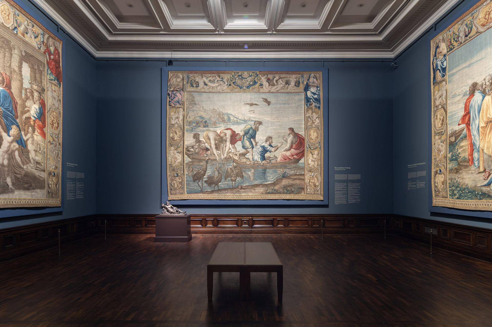

## Kopfschütteln

_Wenn die Worte fehlen._

Eigentlich habe ich immer angenommen, dass Spionagefilme Fiktion sind. Wenn man hört, dass man Alexej Nawalny wahrscheinlich Gift in den Tee gemischt hat, kommen aber Zweifel auf. Wie muss man sich das vorstellen? Schleicht sich dann ein Agent in Kellner-Verkleidung in das Café und mischt sich mit falschem Bart unter das restliche Personal? Und zieht er dann eine kleine Flasche mit einem Totenkopf aus seinem Ärmel, um einige Tropfen in den dampfenden Tee fallen zu lassen? Irgendwie so, muss es gewesen sein. Erstaunlich ist nur, dass 007 nicht zur Stelle war um zu rufen: "He, was machen Sie da?!", gefolgt von einer halsbrecherischen Verfolgungsjagd quer durch den Flughafen (hier wurde Nawalny ja mutmaßlich vergiftet).

Lustig ist das eigentlich alles nicht, die Russen stellen sich natürlich blöd und wissen von gar nichts. Wie spricht man mit einem Land, dass seine Gegner vergiftet? Keine Ahnung. Sicher ist nur, man sollte immer seinen eigenen Tee dabei haben. Und darüber kann man nur seinen Kopf schüttlen.

## Ist ein Blick wert!

_Wirklich. Mehr gibt es dazu nicht zu sagen._

<iframe width="560" height="315" src="https://www.youtube-nocookie.com/embed/omigBsOmtjw" frameborder="0" allow="accelerometer; autoplay; clipboard-write; encrypted-media; gyroscope; picture-in-picture" allowfullscreen></iframe>

## Wäre ein Blick wert!

_Es gibt Dinge, die gibt es nicht. Aber wenn es sie gäbe, dann wären sie einen Blick Wert. Heute: Letzte Minuten_

Sein Finger zischte über den Bildschirm und Bilder schossen in bunten Schlieren vorüber. Ein kurzes Innehalten, ein Doppeltippen, dann wieder Farbschlieren auf dem verschmierten Display. Er saß in seinem großen Ohrensessel, sein gebrechlicher Körper in sich zusammen gesunken. In der einen Hand hielt er ein Smartphone, die andere schwebte einige Zentimeter über dem Glas. Nur ein knorriger Finger huschte rastlos umher. Er war müde, viel zu müde aber noch konnte er nicht aufhören. Noch war er nicht am Ende angelangt. Sein Finger zuckte, rasend schnell scrollten die Bilder an ihm vorbei, wurden langsamer, standen für einen Augenblick. Dann schnellte wieder der Finger nach oben und die Bilder wurden wieder zu fast unerkennbaren Farbtupfern.

Jahre saß er schon so da, fest entschlossen endlich das Ende zu erreichen, endlich alles gesehen zu haben. Am Anfang waren seine Finger noch jung und elastisch, mittlerweile aber schmerzte jede Bewegung. Er musste weiter machen, er war so nah dran, so nah, wie noch nie. Und dann, ganz plötzlich hielt die Bilderflut an. Er zog den Finger nach oben, das letzte Bild löste sich zäh vom Bildrand, schnellte dann aber wieder an seine ursprüngliche Position zurück. Er hatte es geschafft, er war ganz unten angekommen. Seine Augen wurden glasig und seine Hände ganz kalt. Als er seine letzte Lebenskraft aushauchte, lächelte er.

Das Handy war ihm in den Schoß gefallen. Unbeeindruckt strahlte es weiter sein kaltes Licht aus. Es lag eine Weile so da, dann tauchte ganz unten ein kleines Rad auf und drehte und drehte sich wild um sich selbst.

## Zu Tisch

_Wird viel geredet. Worüber, ist oft erinnerungswürdig._

In der Dresdener Ausstellung der _alten Meister_ sind momentan Teppiche ausgestellt. Groß wird dort die _"umfangreiche Sonderausstellung zu den Dresdner Bildteppichen des bedeutenden Malers und Architekten der italienischen Hochrenaissance"_ beworben.

Auch, wenn sich Teppiche nicht wie die spannendste Sache der Welt anhören, so kommt man nicht umhin beeindruckt zu sein. Da ist zum einen das gewaltige Format der Teppiche. Es scheint als hätte man auch früher schon gewusst, größer ist besser. Die Textilbahnen spannen sich fünf Meter die Wand entlang und vier die Wand hinauf, sodass es fast schon unmöglich ist, den ganzen Teppich mit einem Blick zu erfassen. Dargestellt sind allerlei wichtige Bibelstellen. Dort sieht man einen geheilten Krüppel und hier ein übervolles Fischernetz. All diese Szenen stammen von dem großen Raphael. Darauf wird man auch an jeder Ecke hingewiesen. Alle sind mächtig stolz, dass sie Wandteppiche von Raphael aufhängen dürfen.

Wenn man genau hin liest, merkt man aber, dass gar nicht Raphael diese Wandteppiche angefertigt hat, sondern dass sie nur nach seinem Entwurf entstanden sind. Da tun einem ja die Teppichweber leid, erwähnt werde die nämlich nicht. So einen Teppich herzustellen ist ganz schön schwer. Reihe für Reihe wird der Teppich aufgebaut. Das ist in etwa so als hätte Davinci oben links in der Ecke anfangen zu malen und sich dann Strich für Strich vorarbeiten. Jedes Detail bedacht und als er unten rechts angekommen war, lag die Mona Lisa fertig vor ihm. Wenn ich Teppichweber wäre, würde ich mich heftig beschweren.

_[Wer sich einmal anschauen will, wie schwer es ist so einen Teppich zu knüpfen kann mal hier schauen.](https://www.youtube.com/watch?v=jIbu-dJuEh0)_

## Satzfetzen

_Irgendwann findet man sie auf der ersten Seite eines gewichtigen Buches. Bis dahin findet man sie hier._

> Jeder ist in sich gegangen und außer sich wieder rausgekommen!  
> _— R_

> Du weißt, wie weit ich ohne Brain gekommen bin.  
> _— Tim_

## Ein GIF für alle Fälle

_Wer kennt es nicht: Ganz plötzlich braucht man ein GIF, hat aber gerade keins zur Stelle._

<iframe src="https://giphy.com/embed/kegY9CGTP2ybe" width="100%" height="100%" style="position:absolute" frameBorder="0" class="giphy-embed" allowFullScreen></iframe>

