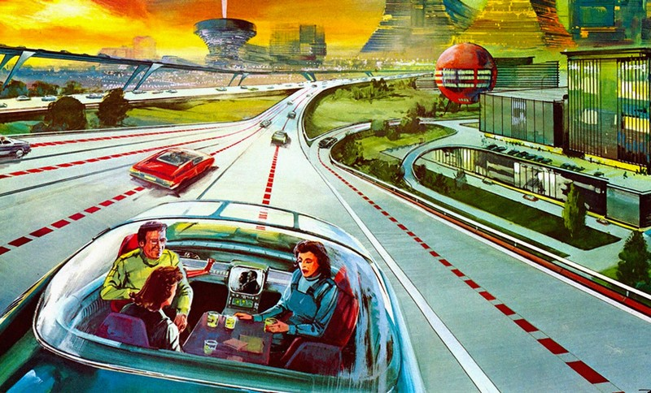
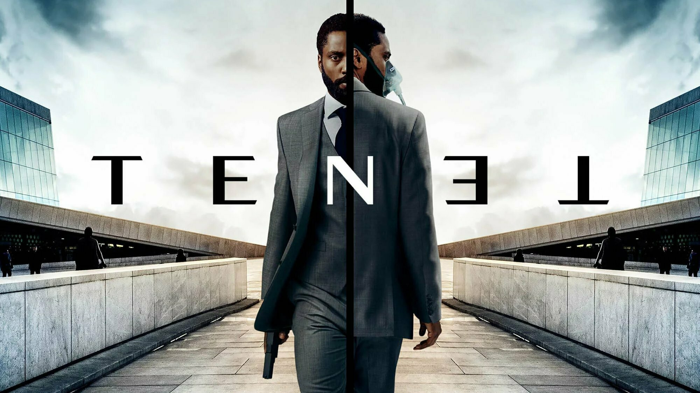
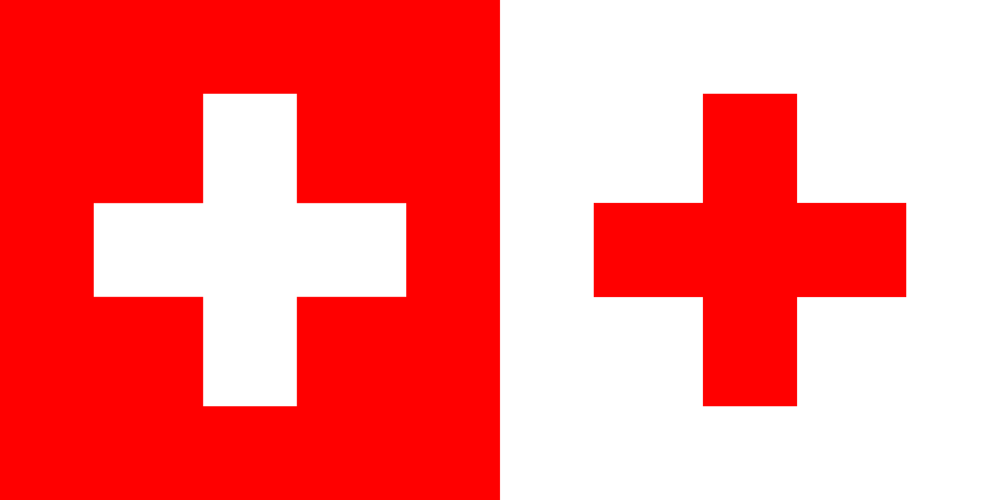

## Kopfschütteln

_Wenn, die Worte fehlen._

Manchmal scheint es so, als gäbe es in Deutschland nur einen einzigen Philosophen. Richard David Precht heißt der Gute und er hat eine besonders interessante Sicht auf selbstfahrende Autos. Wenn er seine Kritik äußert, dann meint er nur das autonome Fahren in belebten Groß- und Innenstädten.



Zuerst einmal, muss man sich klarmachen, was autonomes Fahren konkret bedeutet: Nämlich, dass in Sensoren verpackte Räder durch die Gegend gurken und ständig möglichst viele Daten erfassen, um auch ja nicht gegen einen Baum zu fahren. Sicherlich ist es viel sicherer, wenn die einzelnen Autos sich untereinander austauschen, ihre Daten und Informationen über andere Verkehrsteilnehmer teilen. Die Autos würden von alleine rumfahren, Fußgänger müssten beim über die Straße gehen nicht mehr gucken, denn nun sitzt ja nicht mehr irgendein unaufmerksamer Herbert am Steuer, sondern ein Multi-Mllionen-Euro-Konzern, der es sich nicht leisten kann auch nur _ein_ unachtsames Kind zu überfahren. Und ganz plötzlich, quasi nebenbei, hat man ein totales Überwachungsnetzwerk gebastelt. Wir wissen natürlich, dass alle versprechen werden, diese Daten nur mit _höchster_ _Sorgfalt_ zu behandel. Wenn Horst Seehofer aber große Augen macht und doch noch mit seinen "Sicherheitsgesetzen" durchkommt oder Facebook aus Nächstenliebe einfach noch ein bisschen bessere Werbung zeigen möchte, dann muss man sich wahrscheinlich doch fragen, wie belastbar ein solches Versprechen ist. Ganz zu schweigen von der prinzipiellen Gefahr, die eine potenzielle Totalüberwachung so mit sich bringt.

Wenn mich jetzt jemand fragt, ob ich autonomes Fahren will, dann bleibt mir nur eines: Kopfschütteln.

## Ist ein Blick wert!

_Wirklich. Mehr gibt es dazu nicht zu sagen. Heute muss man dafür allerdings vor die Tür gehen._



## Lyrish

-**ish** (_suffix)_: _used to form adjectives that say what a person, thing, or action is like._

Vor kurzem aß ich eine Orange. Einige Zeit versuchte ich eben diese Orange zu schälen. Vergeblich. Also blickte ich mich verstohlen um, beugte mich über die Spüle und versenkte meine Zähne im süßen Fruchtfleisch. Und wie mir so der Saft das Kinn hinab läuft kommt mir eine Einsicht:

```
Wie Tiere

Wenn sie alleine sind, essen alle anderen wie Tiere
Sie schaufeln und stopfen
Kleckern und tropfen
Speichel läuft ihnen das Kinn hinab
Mit gefletschten Zähnen reißen sie Stücke ab
Es tut mir leid, dass ich das hier so graphisch Skizziere

Aber wirklich, ein jeder, mit Außnahme von dir
benimmt sich beim essen allein' wie ein wildes Tier
Egal ob König, ob Kaiser, Kanzler, Minister
Ist er alleine schmatzt er und frisst er
Päpste und Priester, Äbte, Propheten
Stecken armtief in Schweinepasteten

Jetzt fällt dir sicher schon auf, dass wenn beim essen
sich jemand völlig daneben benimmt
Hat man bestimmt nur vergessen
Dass wir doch gar nicht alleine sind
```

## Zu Tisch

_Wird viel geredet. Worüber, ist oft erinnerungswürdig._

Was ist das Gegenteil eines Baumes? Keine Ahnung? Ich auch nicht. Es gibt viele Dinge die haben einfach kein Gegenteil. Manch andere, unerwarteterweise, allerdings schon.

Die Schweiz ist, trotz seiner zentralen Lage in Europa, nicht Teil einer übernationalen Staatenunion. Sie ist ein Staat, der sich recht erfolgreich aus zwei Weltkriegen herausgehalten hat. Man findet auf der Welt keinen anderen Ort an dem Leben und Dienstleistungen so teuer sind, wie in der hier. Wer in der Schweiz lebt, kann sich zu denen zählen, die eine besonders hohe Lebensqualität genießen. Zu guter Letzt, bietet die Schweiz atemberaubende Panoramen und Naturerlebnisse.



Das rote Kreuz ist eine übernationale Organisation, die sich immer dann einmischt, wenn irgendwo auf der Welt ein Krieg ausbricht oder eine Naturkatastrophe die Menschen hilfsbedürftig macht. Das rote Kreuz bietet seine Hilfe und Dienstleistung umsonst und ohne Gegenleistung an. Wer das rote Kreuz über sich sieht, kann sich getrost zu denen zählen, denen es gerade besonders dreckig geht. Zu guter Letzt, bietet das rote Kreuz nicht mal atemberaubende Panoramen und Naturerlebnisse.

Erstaunlich, einfach erstaunlich.

## Satzfetzen

_Irgendwann findet man sie auf der ersten Seite eines gewichtigen Buches. Bis dahin findet man sie hier._

> Der Klügere gibt nach. Der noch Klügere gibt Nachhilfe.  
> _— Alligatoah_

## Ein GIF für alle Fälle

_Wer kennt es nicht: Ganz plötzlich braucht man ein GIF, hat aber gerade keins zur Stelle._


