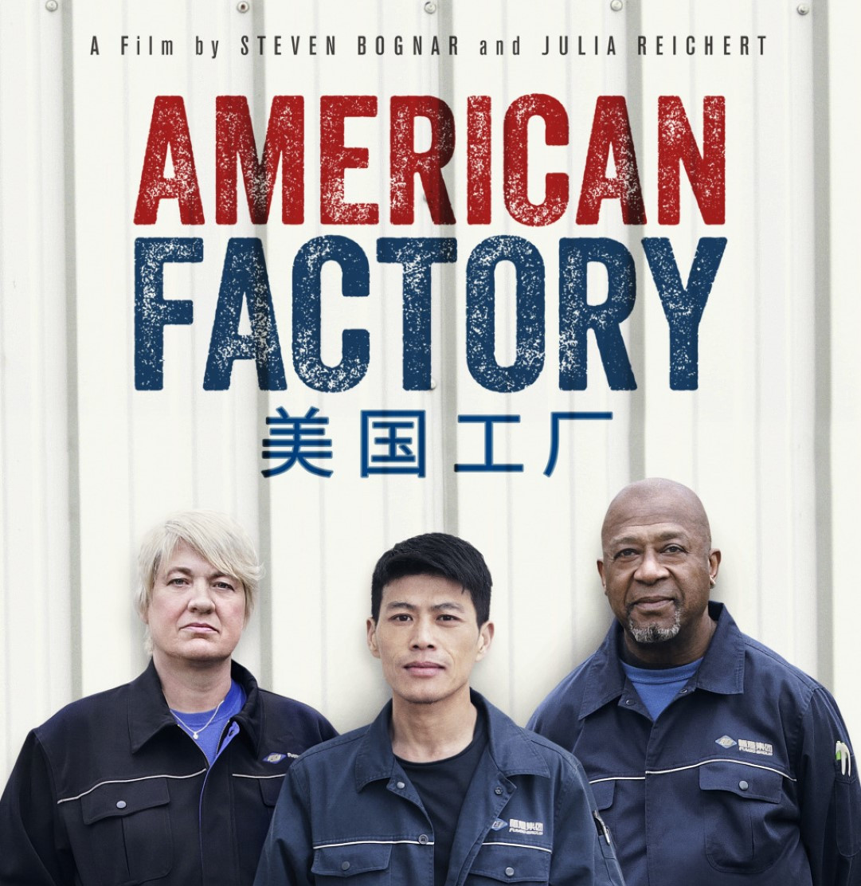

## Kopfschütteln

_Wenn die Worte fehlen._

Organisiertes Verbrechen ist Spaß für die ganze Familie. Was aber machen, mit all dem schmutzigen Geld aus Erpressung, Drogenhandel und Raub? Aus Erfahrung kann ich sagen: Versucht man mit illegalem Geld eine Yacht zu kaufen, steht ganz schnell das Finanzamt vor der Tür. Die netten Herren lassen sich nur schwer davon überzeugen, dass man das ganze Geld auf der Straße gefunden hat. Also muss das Geld gewaschen werden und was würde sich besser eignen als die _russische Waschmaschine_?

Alles, was Sie brauchen sind, zwei Briefkastenfirmen (hier B1 und B2), einen Moldawen (hier Gheorghe), eine Firma mit viel schmutzigem Geld (S) und eine moldawische, gekaufte Richterin (Tatiana). Dann gibt B1 B2 einen Kredit — natürlich nicht wirklich, aber auf dem Papier. Damit der Kredit auch ja nicht ausfällt, übernimmt S die Bürgschaft für B. Gheorghe ist sehr vertrauenswürdig, deshalb setzt man ihn ein, um an dieser Bürgschaft beteiligt zu sein. Unerwarteterweise (das passiert immer) kann B2 seinen Kredit nicht zurückzahlen und die Bürgschaft greift. "Moment", sagt dann S, "so schnell geht das nicht. Wir zahlen nichts." Das Geld ist ja noch schmutzig und bringt Niemandem etwas. Zum Glück ist Gheorghe ja Moldawe und deshalb wird das Verfahren in Tatianas Gerichtssaal ausgefochten. Tatiana erkennt As Forderung an und erlaubt S sein ganzes schmutziges Geld auf Konten des Gerichts zu parken, bevor die es dann an B1 weiterleiten. Plötzlich ist das Geld gar nicht mehr schmutzig. Gheorghe und Tatiana bekommen ihren Teil, B1 und B2 gab es ja sowieso nur auf dem Papier und S kauft sich eine Yacht. So einfach ist das.

Zu entdecken sind solche Modelle leider nur sehr schwer. Bei der russischen Waschmaschine ist es aber gelungen. Die OCCRP schätzt, dass alleine mit dieser Methode — die übrigens wirklich _russische Waschmaschine_ heißt — zwischen 2011 und 2014 \$20 Mrd. gewaschen wurden. Das ist wirklich viel Geld. Da muss sich keiner über die ganzen Yachten in der Karibik wundern. Bei so viel krimineller Energie bleibt nur Eines: Kopfschütteln.

## Ist ein Blick wert!

_Wirklich. Mehr gibt es dazu nicht zu sagen._

American Factory ist eine Dokumentation über das Arbeiten. Sie zeigt, welch unterschiedliche Arbeitsethiken in einer globalisierten Welt möglich sind und wie sie aufeinanderprallen. Hat man Problematiken zunehmender Automatisierung im Hinterkopf, ist es ein Film, der herrliche Diskussion entfacht.

## Wäre ein Blick wert!

_Es gibt Dinge, die gibt es nicht. Aber wenn es sie gäbe, dann wären sie einen Blick Wert. Heute:_

Künstliche Intelligenz ist in aller Munde. Wer am Puls der Zeit sein will, nutzt deshalb den neuen Service von "**I Want AI**". Für große und kleine Unternehmen in allen Branchen und Bereichen.

Zu finden [hier](https://i-want-ai.netlify.app/), oder auf: [https://i-want-ai.netlify.app/](https://i-want-ai.netlify.app/)

Geschäftsmodelle finden sich eben doch an allen Ecken und Enden.

## Sehr witzig

_In der letzten Ausgabe habe ich einen Witz vorgestellt, der nur wenig belacht wurde. Warum?_

Die meisten Menschen lachen gerne. Es gibt nur wenige, die ein völlig ernstes Leben mit herabgezogenen Mundwinkeln gewählt haben. Doch selbst diese armen Seelen, ich kann es nicht anders glauben, lachen, wenn sie lachen, gerne. Das ist doch geradezu fabelhaft. Über alle Kulturen und Geschmäcker, Ansichten und -ismen hinweg, sind wir uns einig, dass das Lachen etwas außerordentlich Gutes ist. Diejenigen, die jetzt schon Harmonie und Einklang wittern, muss ich enttäuschen. Worauf wir uns nämlich gar nicht einigen können, ist, worüber wir lachen. Woran liegt das? Und vielleicht genauso wichtig: Wann müssen wir überhaupt lachen?

Eleganterweise liegt die Antwort der ersten Frage in der Antwort der zweiten. Es ist sicherlich klar, dass niemand die _tatsächliche Antwort_ geben kann, aber dafür gibt es schließlich Theorien. Die überzeugendste, ist die Theorie des _"harmlosen Verstoßes"_ (engl. [benign violation](http://leeds-faculty.colorado.edu/mcgrawp/Benign_Violation_Theory.html)).

Etwas ist lustig, wenn wir es als _Verstoß_ jeglicher Art wahrnehmen, wir aber zur gleichen Zeit auch erkennen, dass es ein harmloser _Verstoß_ ist. Klarer wird diese Überlegung, wenn wir unseren Blick auf etwas äußerst Komisches werfen, das Kitzeln. Gekitzelt zu werden ist für die meisten von uns mit Lachen verbunden. Man kann das Kitzeln als eine Art "Angriff" verstehen, also als einen Verstoß gegen unser Sicherheitsgefühl. Auf der anderen Seite, erkennen wir aber auch schnell, dass dieser "Angriff" völlig harmlos ist, wir müssen lachen. Anders ist das, wenn wir versuchen uns selber zu kitzeln. Das ist dann einfach nur harmlos und gar nicht zum Lachen. Wenn uns, auf der anderen Seite, ein Fremder auf der Straße kitzeln würde, ist das einfach nur ein Verstoß und erst recht nicht zum Lachen. Vielleicht würden wir eher die Polizei rufen.

Hier erkennen wir auch schnell, warum unterschiedliche Menschen unter Umständen unterschiedliche Dinge lustig finde. Es ist eben sehr persönlich, was wir als _Verstoß,_ wahrnehmen und genauso persönlich ist es, was diesen Verstoß dann wieder harmlos macht. Es ist wirklich erstaunlich, wie gut diese einfache Theorie eine sehr breite Palette von Humor und Witzen abdeckt. Sogar nervöses oder unsicheres Lachen lassen sich mit dem "harmlosen Verstoß" erklären. Es ist ein nettes Gedankenspiel, die _harmlosen Verstoße_ im Alltag aufzuspüren. Ob man dadurch lustiger wird, weiß ich allerdings nicht.

Lachen ist etwas, das uns zusammenbringt und hält. Das hört sich zwar kitschig an, aber es ist wahr. Wir lachen lieber und mehr in Gemeinschaft. Gerade deshalb ist es wichtig zu verstehen, warum jemand etwas **nicht** lustig findet. Ist es, weil wir uns auf der zu harmlosen Seite befinden? Oder, weil sich wirklich jemand verletzt fühlt? Witze sind immer eine Gratwanderung, das kann man im Hinterkopf behalten. Das sollte aber niemanden davon abhalten diese Gratwanderung zu versuchen.

## Satzfetzen

_Irgendwann findet man sie auf der ersten Seite eines gewichtigen Buches. Bis dahin findet man sie hier._

> Explaining a joke is like dissecting a frog. You understand it better but the frog dies in the process. — E.B. White

## Ein GIF für alle Fälle

_Wer kennt es nicht: Ganz plötzlich braucht man ein GIF, hat aber gerade keins zur Stelle._

<iframe src="https://giphy.com/embed/FcFGtKKzKpWso" width="100%" height="100%" style="position:absolute" frameBorder="0" class="giphy-embed" allowFullScreen></iframe>

