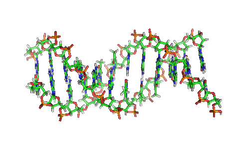
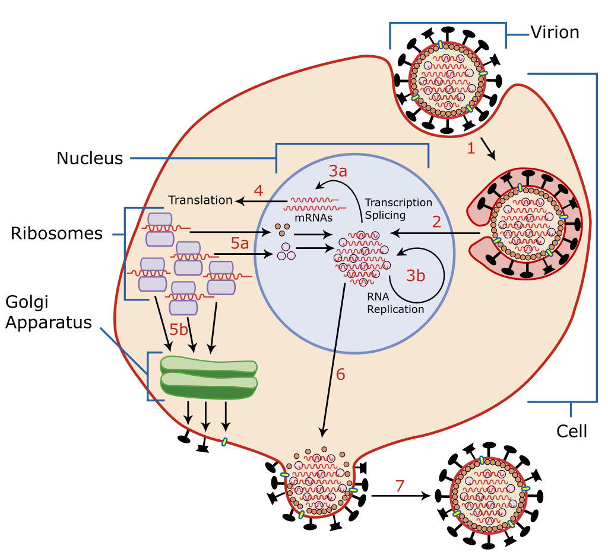

## Der letzte Tag im alten Jahr

Der letzte Tag im Jahr hat etwas Besonderes an sich. Nicht nur, weil man zusammen feierlich das alte Jahr verabschiedet, sondern weil sich an keinem Tag sonst die Zukunft so nah anfühlt. Spricht man unterm Jahr von der "_Welt von morgen_", hat dies immer etwas Unnahbares, vielleicht sogar etwas Prophetisches. Der bevorstehende Sprung ins neue Jahr ändert das. Man wird sich schlagartig bewusst: Heute ist schon fast _morgen_!

Vor kurzem hatte ich diesen Moment als ich etwas über die Neuentdeckung eines alten Speichermediums erfahren habe. Erstaunlicherweise wird dieses Speichermedium schon seit Millionen von Jahren verwendet. Alles, was Leben auf der Erde ausmacht, wird so gespeichert und in der Regel auch an nachfolgende Generationen weitergegeben. Die Rede ist von DNA. Ist es nicht erstaunlich, dass Menschen jetzt nicht nur DNA lesen, sondern auch jegliche [Informationen in DNA speichern können](https://www.twistbioscience.com/products/storage)? Ich finde schon! Die Frage bleibt aber: Warum sollte man das machen?

Die Antwort fällt leicht. DNA ist verdammt klein und kann verdammt alt werden. Die Menschheit versucht, vielleicht schon seit ein paar tausend Jahren Informationen zu konservieren; mit mäßigem Erfolg. Heute müssen klassische digitale Datenarchive c.a. alle 10 Jahre erneuert werden, weil irgendwann die Technik versagt. Für besonders langlebige Daten gibt es M-Discs, die, wenn es gut geht, um die 1.000 Jahre halten. Will man etwas noch länger erhalten, muss man es mit einem Hammer in eine Keramiktafel meißeln. Wer allerdings schon mal DNA aus Mammutknochen gezogen hat, der weiß, DNA hält ziemlich lange. Sie kann sogar mit unseren Keramiktafeln mithalten und auch noch in 10.000 Jahren ausgelesen werden.

Wie verhält es sich aber mit der Speicherdichte? M-Discs halten sich lange, können allerdings nur um die 100 GB pro Stück speichern und dass Keramiktafeln kein effizientes Speichermedium sind, muss ich, glaube ich, nicht erwähnen. DNA ist nicht nur gut was die Speicherdichte angeht, sondern DNA ist direkt auch noch das Beste, was unsere Welt so zu bieten hat. DNA ist so dicht, dass man in einem Gramm DNA 215.000 Terabyte speichern könnte. Oder anders gesagt, alle Filme, die jemals gedreht wurden, könnten wir in einem zuckerwürfelgroßen Klumpen DNA ablegen.

Aller Wahrscheinlichkeit nach wird sich der DNA-Stick in ein paar Jahren nicht als Speichermedium durchgesetzt haben. Dafür dauert es einfach zu lange, Daten zu speichern und [auszulesen](https://en.wikipedia.org/wiki/DNA_sequencer#Comparison). Ich finde es allerdings eine beruhigende Vorstellung, dass wir all die wunderbaren digitalen Erzeugnisse zumindest für eine kleine Ewigkeit speichern können.

## Ist ein Blick wert!

_Wirklich. Mehr gibt es dazu nicht zu sagen._

<iframe width="560" height="315" src="https://www.youtube.com/embed/lG4VkPoG3ko" frameborder="0" allow="accelerometer; autoplay; clipboard-write; encrypted-media; gyroscope; picture-in-picture" allowfullscreen></iframe>

## Was das Jahr so bringt

_Pieks._

2021 wird sich wahrscheinlich neben täglichen Updates von Corona Fall- und Sterbezahlen eine weitere Kennzahl einschleichen, nämlich die Anzahl der schon Geimpften. Da stellt sich doch eine Frage: Wie eigentlich funktioniert dieser Impfstoff, von dem alle so begeistert sind? Klar, alle reden immer von mRNA und einer beschleunigten _"dritten Phase"_, aber das sind leere Begriffe, mit denen man nichts anfangen kann. Schauen wir also, wie uns ein kleiner Pieks davor schützt, krank zu werden.

Bevor man verstehen kann, wie uns mRNA in irgendeiner Weise helfen kann, müssen wir erst verstehen, wie ein Virus funktioniert. Ein Virus kann sich nicht selber vervielfältigen, deshalb braucht es immer eine Wirtszelle, die ihm dabei hilft mehr Viren zu produzieren. Dafür muss das Virus allerdings erstmal in eine Zelle gelangen. Hier kommen die merkwürdigen Auswüchse ins Spiel, die einem bei jeder Abbildung eines Virus ins Auge springen. Diese Auswüchse sind nämlich in Wirklichkeit Proteine, die wie Schlüssel funktionieren. Hat ein Virus das richtige Protein, kann er sich an bestimmte Zellen andocken und sein finsteres Werk verrichten. Schafft es das Virus aber gar nicht erst in die Zelle, kann es sich auch nicht vermehren.

Hier ist also die Front, an der der Kampf ausgetragen wird. Unser Körper muss verhindern, dass das Virus in unsere Zellen gelangt. Dafür hat er sich Antikörper — das sind auch Proteine — ausgedacht, die das perfekte Gegenstück zu den Virusauswüchsen sind. Die Antikörper setzten sich also auf die Virusproteine und verhindern so, dass das Virus an unsere Zellen andocken kann.

Bei vielen Krankheiten findet der Körper selber schnell genug heraus, welches das richtige Antikörperprotein ist, bevor ihn das Virus übermannt. Manchmal muss man allerdings nachhelfen. Hier kann uns die mRNA helfen. Wie wir gelernt haben, ist die einzige Information, die der Körper braucht, um erfolgreich ein Virus abzuwehren, die Beschaffenheit der Virusoberfläche. Und diese Information geben wir dem Körper mit der Impfung. Wir geben den Zellen einen Bauplan der Virusoberflächenproteine. Die Zellen produzieren dann fleißig eben diese Proteine und der Körper kann in der Folge lernen, mit welchen Antikörpern er die neuen Proteine unschädlich machen kann. Das ist alles im Prinzip ungefährlich, es kommt nämlich nie echter Virus in den Körper, sogar der mRNA Bauplan wir mit der Zeit abgebaut. Alles was bleibt, ist eine Zelle, die sich ziemlich genau an die Oberfläche des Virus erinnert und die passenden Antikörper immer parat hat.

Auf einer hohen Abstraktionsebene zu verstehen, wie mRNA funktioniert, ist also gar nicht so schwer. Impfen ist und bleibt in Deutschland Sache des Einzelnen. Eine Entscheidung kann man allerdings nur treffen, wenn man auch weiß, wofür oder wogegen man sich entscheidet. Für meinen Geschmack kommt dieser Teil in der Berichterstattung ein wenig zu kurz.

## Satzfetzen

_Irgendwann findet man sie auf der ersten Seite eines gewichtigen Buches. Bis dahin findet man sie hier._

> Intelligenz ist das, was wir benutzen, wenn wir nicht wissen, was wir tun sollen.  
> — Jean Piaget

## Ein GIF für alle Fälle

_Gerade zum Beginn des Jahres ist es schwer, ein wirklich gutes GIF zu finden. Zu Neujahr möchte man etwas Feines, keine Massenware. Ein GIF, das das eine Jahr gut abschließt und ein perfekter Auftakt für das andere ist._

<iframe src="https://giphy.com/embed/h8ZZof09PFO9A5NL8l" width="100%" height="100%" style="position:absolute" frameBorder="0" class="giphy-embed" allowFullScreen></iframe>

