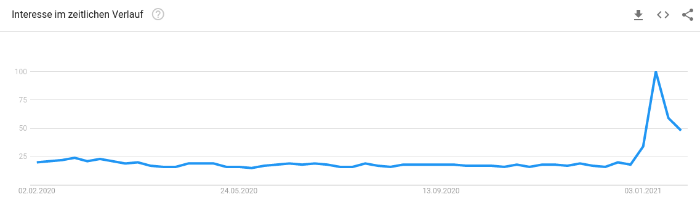

## Mehr Meinungsfreiheit

Die Meinungsfreiheit ist bedroht! Nicht, weil absurde Äußerungen von angeblich gleichgeschalteten Staatsmedien _zensiert_ werden, sondern weil einfach niemand mehr Meinungs-**frei** ist. Alle haben das Gefühl, zu allem immer eine Meinung haben zu müssen. Niemand hat mehr keine Meinung. Ich habe mich gefragt, warum ist das so und vor allem was hat das für einen Einfluss.

Zuerst einmal ist es eigentlich gar nicht leicht, eine Meinung zu haben. Meinungen muss man sich nämlich bilden. Zumeist ist das ein recht aufwendiger Prozess, der von Abwägungen, verschiedenen Blickwinkeln und Werturteilen geprägt wird. Eine eigene Meinung fällt einem nicht einfach so zu und eine fremde Meinung kann man nicht einfach so übernehmen. Man muss sie sich erarbeiten. Wie kommen trotzdem so viele Leute in allen erdenklichen Themen zu einer Meinung? Sie nutzen die _Impuls-Abkürzung._ Anstatt einer gebildeten Meinung bekommt man eine intuitive Mischung aus Gefühl und subjektiver Wahrnehmung. Was als Meinung verkauft wird, ist gar keine. Müssen wir hierin ein Problem sehen? Mit Sicherheit, schließlich ist _eine-Meinung-haben_ die Grundlage für Entscheidungen in einer Demokratie. Wenn alle nur auf ihr Bauchgefühl hören, kann man nicht erwarten, dass es nennenswerte Bewegungen in irgendeine Richtung gibt. Was ist nun aber mit denen, die professionell eine Meinung vertreten, können die uns aus der Misere helfen?

#### Die Expertenmeinung

Expertinnen zeichnen sich in der Regel dadurch aus, dass sie über mehr _Wissen_ und _Erkenntnis_ in einem Themengebiet verfügen als die meisten anderen. Im besten Fall können Expertinnen also erklären, wie die Dinge stehen und vor allem auch, warum sie so stehen. Damit legen sie die vielleicht wichtigste Grundlage für die Meinungsbildung.

Tatsächlich aber werden Experten immer öfter nach ihrer Meinung gefragt, anstatt nach dem allgemeinen Wissensstand. In gewisser Weise ist das auch verständlich: Wissenschaftliche Erkenntnis ist selten eindeutig und immer öfter eher ein Erkenntnisspektrum. Klare Aussagen, wie wir sie in Nachrichten oder Talkshows hören wollen, bekommt man nur dann, wenn man nach einer Meinung fragt.

So vermischt sich allerdings all die wichtige Erkenntnis mit persönlichen Werten und Einschätzungen. Plötzlich hat die Expertin auch "nur" noch eine Meinung. Wenn man nicht gut findet, was die da sagt, ist man einfach nicht einer Meinung mit ihr. Weil _nicht-einer-Meinung-sein_ eine Grundeigenschaft von Demokratie ist, scheint das auf den ersten Blick völlig legitim. Tatsächlich aber sind in der Darstellung Fakten und persönliche Abwägung so stark miteinander verwoben, dass diese nur noch schwer voneinander trennbar sind. Ein Ablehnen der Meinung geht dann auch mit der Ablehnung der Faktenbasis dieser Meinung einher.

Hinzu kommt noch, dass Expertenmeinungen gegeneinander ausgespielt werden und so der Eindruck entsteht, "die Wissenschaft" — die es ja eigentlich gar nicht gibt — sei sich nicht einig. Hier lässt man auch außer Acht, dass man, selbst wenn man die gleiche Erkenntnisbasis hat, zu unterschiedlichen Meinungen kommen kann.

Das ist das eigentliche Problem. Wir sollten uns bemühen, eine gemeinsame Basis von Fakten und Werten zu finden, von der aus sich jeder eine Meinung bilden kann. Stattdessen, stellen wir die Meinung selbst in den Mittelpunkt. Und weil alle gewohnt sind, anderer Meinung zu sein, setzen sie sich einfach über das in der Meinung versteckte Wissen hinweg.

#### Dazu habe ich keine Meinung!

Um dem entgegenzuwirken, wünsche ich mir, dass es normaler wird, keine Meinung zu haben und das auch zu sagen. Versteht mich nicht falsch, ich will nicht, dass weniger Menschen eine Meinung haben — das Gegenteil ist der Fall. Man muss sich nur eben nicht zu einer Meinung verpflichtet fühlen. Schlechter als keine Meinung zu haben, ist es nämlich, ein Gefühl mit einer Meinung zu verwechseln.

Damit die Meinungs-**Freiheit** wieder in der Mitte der Gesellschaft ankommt, fordere ich jede und jeden auf, sich mal wieder klar ohne Position zu positionieren. Ich möchte, dass auf reißerische Talkshow-Fragen, "Dazu habe ich keine Meinung!", geantwortet wird. Man sollte als Politiker "Das ist so gar nicht mein Themenbereich, fragen sie doch jemand anderen", sagen, ohne dass es gleich als Charakterschwäche gewertet wird. Man kann nicht immer zu allem eine Meinung haben und man sollte es auch nicht.

Das ist allerdings nur meine Meinung.

## Ist ein Blick wert!

_Wirklich. Mehr gibt es dazu nicht zu sagen._

<iframe width="560" height="315" src="https://www.youtube-nocookie.com/embed/VkSmaFAuaH4" frameborder="0" allow="accelerometer; autoplay; clipboard-write; encrypted-media; gyroscope; picture-in-picture" ></iframe>

## Signale erkennen

_Wer hat uns verraten? Metadaten!_

Das hier ist kein Corona-Graph, sondern die Suchergebnisse für den Messenger _Signal_. Warum dieses plötzliche Interesse? Nun, WhatsApp hat seine Nutzungsbedingung aktualisiert. Von nun an möchte WhatsApp seine Daten an seinen Mutterkonzern Facebook weitergeben. Dabei hatte Facebook beim Kauf von WhatsApp eigentlich versprochen, die Daten nicht zu vermischen. Bei einem Unternehmen, dessen Geschäftsmodell das Sammeln von nutzerbezogenen Daten ist, muss es einen nicht sonderlich stark wundern, dass Facebook diesen Schritt jetzt doch gehen will.

_Was ist überhaupt das Problem? Meine Nachrichten sind doch Ende-zu-Ende verschlüsselt, mitlesen kann da doch keiner?_ Das ist richtig und Facebook würde sich schon in sehr gefährliches Fahrwasser begeben, wenn sie heimlich die Verschlüsselung umgehen würden. Facebook ist allerdings auch gar nicht an deinen Nachrichten interessiert. Das, was Facebook interessiert, sind sogenannte Metadaten. Also Informationen darüber, wer in deinen Kontakten ist, mit wem du in einer Gruppe bist, mit wem du regelmäßig schreibst, wen du blockiert hast, und so weiter und so fort. Facebook nutzt diese Daten, um dein Persönlichkeitsprofil zu verbessern. Eine Freundin von dir hat sich erst letztens von dieser hippen Marke ein T-Shirt gekauft, nachdem sie Werbung auf Instagram gesehen hat? Dich wird das bestimmt auch interessieren! Das Prinzip ist klar.

_Na und, soll Facebook doch meine Daten haben, wo ist das Problem?_ Das Problem ist, dass mehr Daten immer mehr Macht bedeuten. Solange diese Macht von einem einigermaßen progressiven Silicon Valley verwaltet wird, scheint alles in bester Ordnung. Danach darf man Macht aber nicht bewerten. Man sollte immer darauf schauen, welchen Missbrauch es im schlimmsten Fall geben kann. Für eine Datenbank in der über jeden steht, mit wem er verkehrt, was er denkt und auch, auf was er steht, fallen mir eine Menge Missbrauchsmöglichkeiten ein. Außerdem ist da noch das Geschäftsmodell von Facebook. Dieses ist keinesfalls, soziale Netzwerke oder Messenger anzubieten, sondern Werbung zu verkaufen. Das bedeutet auch, dass für Facebook nicht das Interesse des Nutzers, sondern das Interesse der Werbetreibenden im Vordergrund steht.

_Deshalb der Sprung zu Signal. Ist das denn so viel besser?_ Klare Antwort: Ja! Signal ist nämlich quelloffen und eine gemeinnützige Organisation. An der Stelle, an der Facebook einen Messenger anbietet, um an deine Daten zu kommen, möchte Signal einen Messengerdienst anbieten, weil es eben einen Messenger anbieten will. Signal ist nicht nur Mittel zum Zweck und das macht es einfach attraktiver.

_Aber, aber es sind doch auch alle anderen bei WhatsApp, was soll ich dann auf Signal?_ Das nennt man Lock-In-Effekt und ist natürlich ein Problem. Aber man muss ja nicht gleich das halbe Land überzeugen. Es reichen einige aus dem Freundeskreis, die dann wieder ihre Freunde überzeugen. Wie schnell solche Weitergabeketten funktionieren können, muss ich, glaube ich, nicht erläutern — der Pandemie-Alltag übernimmt das für mich. Wichtig ist nur eine gewisse Konsequenz. Man muss nicht gleich WhatsApp löschen — das ist natürlich das endgültige Ziel — aber man sollte nicht bei der ersten Gelegenheit zurückwechseln. Drastischer Tipp von meiner Seite: Einfach diejenigen auf WhatsApp blockieren, die man zu Signal ziehen will. So kommt man erst gar nicht in Versuchung.

_Was ist mit Threema und Telegram, geht das auch?_ Gegen Threema spricht im Prinzip wenig, nur ist es eben nicht umsonst und auch nicht komplett quelloffen. Außerdem ist es deutlich unbekannter als Signal. Telegram auf der anderen Seite ist eine Katastrophe. Nicht nur wimmelt es hier von Verschwörungsschwurblern, sondern Telegram kann in der Standardeinstellung auch noch alle Nachrichten mitlesen. Außerdem ist Telegram in unklare, russische Unternehmensstrukturen verwickelt und so gar nicht quelloffen. Also schreibt mir auf Signal!

Übrigens, dass die AGB Änderungen gar keine Auswirkungen auf den europäischen Markt haben, unterschlage ich mal. Früher oder später will Facebook das hierzulande bestimmt auch machen und Metadaten sammeln sie auch jetzt schon wie die Verrückten.

## Satzfetzen

_Irgendwann findet man sie auf der ersten Seite eines gewichtigen Buches. Bis dahin findet man sie hier._

> Wenn auf dem Grabstein der Institutionen steht "Sie hatten recht", hilft das niemandem.
> — Jörg Sommer, Direktor des Berliner Instituts für Partizipation in [dieser Doku](https://www.zdf.de/dokumentation/zdfzoom/am-puls-deutschlands---der-querdenker-effekt---kann-uns-corona-spalten-100.html)

## Ein GIF für alle Fälle

_Wer kennt es nicht: Ganz plötzlich braucht man ein GIF, hat aber gerade keins zur Stelle._

