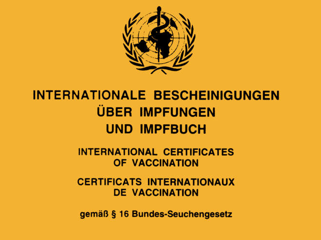
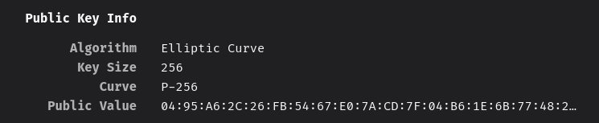

## Gelber Zettel, aber digital

Deutschland impft. Das Schöne: Wer geimpft ist, kann sich nicht nur sicher fühlen, er bekommt wahrscheinlich auch ein Stück Normalität zurück. Wer die Freiheit will, muss aber sein zerfleddertes, gelbes Impfheft vorlegen. Den Leuten einfach glauben, dass sie geimpft sind, kann man schließlich nicht. Diejenigen, die jetzt Schweißausbrüche bekommen, weil sie ihren Impfpass schon lange nicht mehr gesehen haben, können aber ganz entspannt sein; bald schon soll ein moderner, sicherer und digitaler Impfpass kommen.

Es stellt sich hier, wie bei jedem Dokument, digital oder analog, die Frage, wie Authentizität nachgewiesen werden kann. In einer analogen Welt geschieht dies über einen Stempel, eine Unterschrift und einen kleinen Aufkleber. Wirklich fälschungssicher ist das zwar nicht, aber eine gewisse Hürde gibt es dennoch. Im digitalen Kontext ist es viel weniger offensichtlich, wie man bei einem solchen Dokument Echtheit nachweist. Schließlich lassen sich digitale Dokumente beliebig vervielfältigen und im Grunde ziemlich leicht verändern. Eine PDF auf der steht, dass _Jasper Anders wirklich schon geimpft ist_, ist also nicht sonderlich glaubwürdig.

Zunächst kam man ja auf den wirren Gedanken, einen Blockchain wäre das Mittel der Wahl, um einen unfälschbaren Impfpass zu erstellen. Davon hat man sich allerdings schnell wieder verabschiedet. Stattdessen will man jetzt auf eine Public-Key-Infrastruktur (PKI) zurückgreifen. Ein langes, [magisches](https://www.jasperanders.xyz/2021/04/) Wort, welches eindeutig erklärungsbedürftig ist. Dazu machen wir einen kleinen Ausflug in die wunderbare Welt der Verschlüsselung.

Bei einer Verschlüsselung nimmt man, mithilfe eines Schlüssels, an einem Klartext so komplizierte Veränderungen vor, dass eine dritte Person, die den Schlüssel nicht kennt, in realistischer Zeit keine Chance hat herauszufinden, was der ursprüngliche Text einmal war. Soweit so gut! Man kann sich leicht vorstellen, dass man nach diesem Prinzip z.B. eine Festplatte leicht verschlüsseln kann. Ich lege vor der Verschlüsselung einen Schlüssel fest und wenn ich dann wieder an meine Daten will, nutze ich den gleichen Schlüssel, um meine Daten wieder zu entschlüsseln.

Was passiert aber, wenn ich meine Kommunikation verschlüsseln will? Meine Kommunikationspartnerin muss den Schlüssel ja auch kennen, um die Nachricht zu verstehen. Schicken kann ich ihr diesen aber _mit Sicherheit_ nicht (kleiner Wortwitz). Wenn ich den Schlüssel unverschlüsselt verschicke, kann er ja von jedem gesehen werden und dann kann ich mir die Verschlüsselung auch gleich sparen. Verschlüsselung mit nur *einem* Schlüssel, auch symmetrisch genannt, stößt hier an ihre Grenzen. Zum Glück haben sich einige schlaue Mathematiker die asymmetrische Verschlüsselung ausgedacht.

Die asymmetrische Verschlüsselung ist deshalb asymmetrisch, weil sie statt einem Schlüssel zwei unterschiedliche verwendet. Beide Schlüssel sind so gewählt, dass sie eine besondere Eigenschaft haben: Verschlüssele ich etwas mit Schlüssel 1, kann es **nur** noch mit Schlüssel 2 entschlüsselt werden. Die beiden Schlüssel sind übrigens verschieden, haben aber das gleiche Format. Ich kann also auch andersrum etwas mit Schlüssel 2 verschlüsseln und es dann **nur** noch mit Schlüssel 1 entschlüsseln. Mit einem Mal ist die Verschlüsselung von Nachrichten gar nicht mehr kompliziert. Ich muss mich nur dazu entscheiden, einen der beiden Schlüssel geheim zu halten und den anderen so öffentlich wie möglich zu machen. Will mir [Alice](https://en.wikipedia.org/wiki/Alice_and_Bob) jetzt eine Nachricht schicken, verschlüsselt sie ihre Nachricht mit **meinem öffentlichen** Schlüssel. Ich bin nun der einzige, der diese Nachricht lesen kann, denn nur **mein privater** Schlüssel ist in der Lage die Nachricht von Alice zu entschlüsseln.

Das hört sich schon mal ziemlich gut an, noch besser wird es aber, wenn ich eine Nachricht mit **meinem privaten** Schlüssel verschlüssele. Jeder, der über meinen öffentlichen Schlüssel verfügt, kann jetzt diese Nachricht lesen. Das scheint erst einmal unsinnig, schließlich hat jeder Zugriff auf meinen Schlüssel. Es könnten also tatsächlich alle meine Nachricht lesen. Wichtig ist aber, dass die Nachricht, nur dann mit **meinem öffentlichen** Schlüssel gelesen werden kann, wenn sie vorher mit **meinem privaten** Schlüssel verschlüsselt wurde. Und da nur ich meinen privaten Schlüssel kenne, kann man sich sicher sein, dass die Nachricht auch tatsächlich von mir kommt. Asymmetrischen Verschlüsselung ermöglicht also quasi eine unfälschbare, digitale Unterschrift.

Wir sehen also, dass asymmetrische Verschlüsselung wirklich praktisch ist. Mit ihrer Hilfe können wir sicher Nachrichten verschicken und uns bei empfangenen Nachrichten sicher sein, von wem sie kommen. Deshalb wird sie übrigens in allen möglichen Bereichen schon seit vielen Jahren eingesetzt. Das kleine Schloss neben den meisten URLs im Browser, haben wir ihr auch zu verdanken. Es sagt aus: "Diese Seite wurde von der Organisation ausgeliefert, die du angefragt hast." Den öffentlichen Schlüssel einer jeden Webseite kannst du dir sogar selber anschauen.

Kommen wir aber zurück zum digitalen Impfass und der Public-Key-Infrastruktur. Was ein Public-Key (öffentlicher Schlüssel) ist, haben wir ja bereits oben geklärt. Der Infrastruktur-Teil bezieht sich auf die Verteilung und Bereitstellung der öffentlichen Schlüssel. Damit jemand eine Signatur überprüfen kann, muss er ja den öffentlichen Schlüssel der Stelle kennen, die z.B. ein Impfpass ausgestellt hat. In der Realität kann eine Impfung natürlich nicht nur von einer einzigen Stelle bestätigt werden, sondern z.B. von einem Impfzentrum oder einem Hausarzt. Da jede dieser Instanzen Impfungen validieren kann, hat auch jede einen eigenen privaten Schlüssel. Die Verwaltung der zugehörigen öffentlichen Schlüssel passiert in einer solchen PKI. Obwohl diese Technologie also schon seit Jahren existiert, ist das breite Ausrollen einer PKI für einen digitalen Impfpass allerdings wirklich schwierig.

Dazu muss nämlich jede Arztpraxis an die PKI angeschlossen werden. Mit Blick auf die aktuelle Digitallandschaft in Deutschland ist das ein gewaltiger Kraftakt, der nicht mit Sicherheit in Gänze vollzogen werden kann. Das bedeutet aber auch, dass analoge Impfpässe bis auf Weiteres als Nachweise gültig bleiben werden. Der Schwachpunkt des Systems liegt dann mit einem Mal nicht mehr in der Kryptografie, sondern in den kleinen gelben Papierzetteln, die man eigentlich loswerden wollte. Vor allem aber zeigt sich hier mal wieder: Die meisten Sicherheitsprobleme sind theoretisch schon lange gelöst. Wenn es doch Lücken gibt, dann weil in der Umsetzung etwas schiefgelaufen ist.

_Ich habe an manchen Stellen vereinfacht, damit das ganze verdaulich bleibt. Nur damit du Bescheid weißt._

## Ist ein Blick wert!

_Uff, ganz schön langes Video und dann noch Mathe… Aber es ist gut, wirklich richtig gut!_

<iframe width="560" height="315" src="https://www.youtube-nocookie.com/embed/HeQX2HjkcNo" title="YouTube video player" frameborder="0" allow="accelerometer; autoplay; clipboard-write; encrypted-media; gyroscope; picture-in-picture" allowfullscreen></iframe>

## Satzfetzen

_Irgendwann findet man sie auf der ersten Seite eines gewichtigen Buches. Bis dahin findet man sie hier._

> Reichst du mir mal den Googleschreiber?  
> — V. A.

## Ein GIF für alle Fälle

_Wer kennt es nicht: Ganz plötzlich braucht man ein GIF, hat aber gerade keins zur Stelle._

<iframe src="https://giphy.com/embed/yy1RLVzuSAiFa" width="480" height="251" frameBorder="0" class="giphy-embed" allowFullScreen></iframe>
