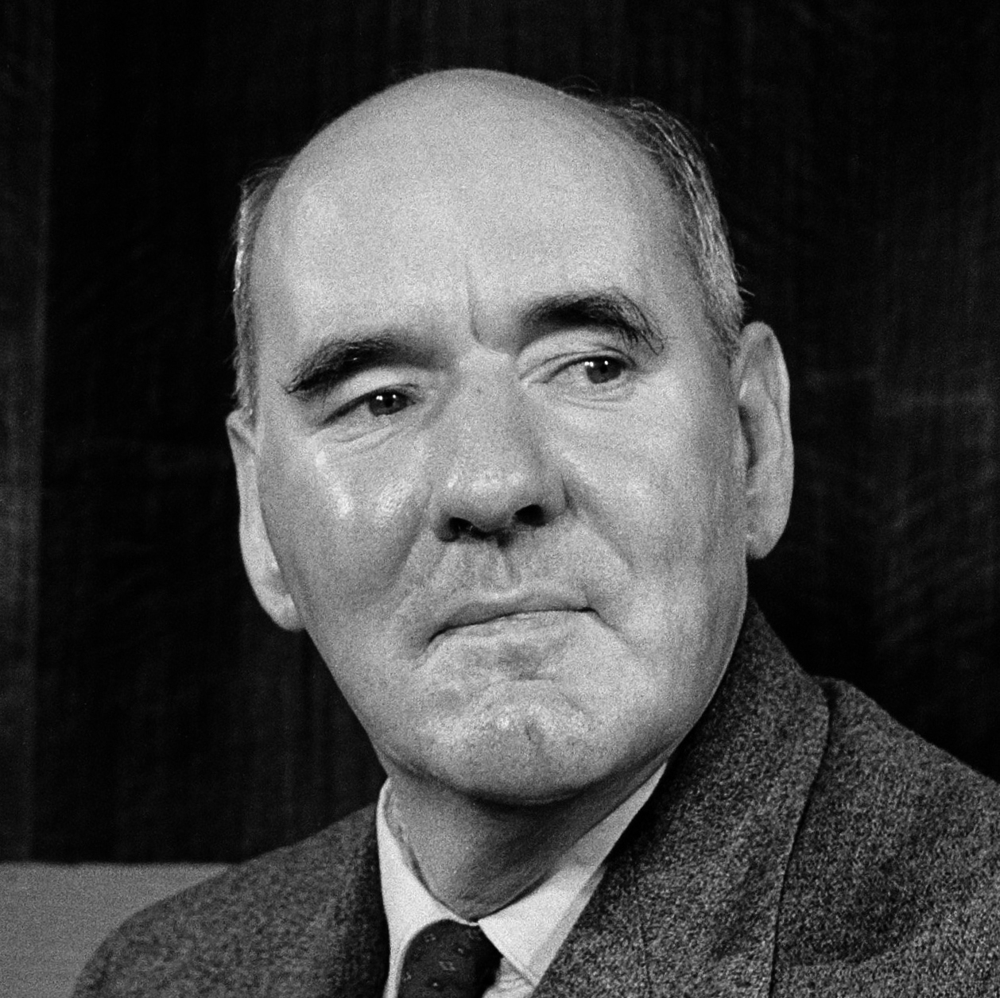

# Offensichtliche Erkenntnis

_Cyril Northcote Parkinson_ war Historiker, Soziologe und Publizist. Drei, in ihrer Kombination wirklich wohlklingende Berufsbezeichnungen. In dieser Funktion hat er natürlich viel geschrieben; im kollektiven Gedächtnis blieb allerdings nur, der heute als Parkinsons Gesetz bekannte Satz:

> »[...] Work expands so as to fill the time available for its completion.«
> _— [aus Parkinsons Law, Economist vom 19 Nov. 1955](https://www.economist.com/news/1955/11/19/parkinsons-law)_

Die Erkenntnis, die in diesem Satz steckt, ist wahrscheinlich für die allermeisten nicht wahnsinnig überraschend. Jeder kennt die langen Stunden, die man mit einem Projekt verbringt, nur um den wirklich wichtigen Teil erst in den letzten Tagen oder Wochen (je nach Aufgabe) fertigzustellen. Es ist also nicht bahnbrechend aufzuschreiben, dass sich Arbeitszeit in großzügigen Schranken ausdehnen oder zusammenziehen kann, ohne, dass der Output sich nennenswert verändert. Wieso lohnt es sich aber trotzdem, nochmal auf eine eigentlich offensichtliche Erkenntnis hinzuweisen?

Der Wert jeder Erkenntnis wird erst dann deutlich, wenn man sie als eine solche anerkennt und dann Handlungen aus ihr ableitet. Aus Parkinsons Satz leite ich zum Beispiel drei Dinge ab:

- Erstens, wenn man Aufgaben vor sich herschiebt, zwängt sich die Arbeit eben in den verbleibenden Zeitraum. Das bedeutet lange Nächte und vor allem Stress. Um diesem vorzubeugen, braucht es kleine Arbeitspakete mit bedeutungsvollen Deadlines. Also solche Fristen, die man sich nicht nur selbst gesetzt hat, sondern die zu überschreiten mindestens sehr unangenehm ist.
- Zweitens, im Zweifel die Dinge immer etwas knapper bemessen. Meetings z.B. nicht großzügig für zwei Stunden ansetzen, um dann zu versprechen, dass man ja früher aufhören könne. Stattdessen nur eine, knapp bemessene Stunde einplanen und zur Not 10 Minuten überziehen.
- Zu guter Letzt und vielleicht auch am wichtigsten bedeutet Elastizität der Arbeit aber, dass man sich manchmal auch einfach Zeit für Dinge nehmen muss, die sonst liegen bleiben. Ein schlechtes Gewissen, braucht man dabei nicht zu haben, die liegengebliebene Arbeit passt sich schließlich ganz von alleine an. Gerade für strategische Themen ist das ein wichtiger Punkt, denn für diese scheint im Tagesgeschäft oft keine Zeit.

Eine Erkenntnis mag selbst also sehr offensichtlich sein, Implikationen und Handlungen, die man aus ihr ableitet, sind es aber schon weniger. Wie viel man am Ende davon tatsächlich noch umsetzt, steht dann nochmal auf einem ganz andern Blatt. Gerade deshalb sind offensichtliche Erkenntnisse besonders tückisch. Bei einem Geistesblitz hat man gleich das Gefühl etwas Bedeutendes gefunden zu haben, nimmt sich einen Moment, über Implikationen nachzudenken und empfindet vielleicht sogar sofort Handlungsdrang. Offensichtliche Erkenntnisse, die sich langsam einschleichen und dann einfach selbstverständlich wirken, können diese Kraft oft nicht entfalten. Umso wichtiger ist es, sich regelmäßig selbst zu zwingen, mal ein paar Erkenntnisse aus der letzten Zeit niederzuschreiben (ich nutze dafür diesen Kanal).

Mit sehr großem Glück, landet man mit seiner Erkenntnis im _Economist_ und ein paar Jahre später hat man einem mehr oder weniger seriösen Prinzip seinen Namen aufgedrückt.

_Ein Fakt noch am Rande_: Parkinson zog seine Erkenntnis eigentlich aus einer ironischen Beobachtung der (Kolonial-) Verwaltung. Diese wuchs seinerzeit nämlich stetig, obwohl sich dafür kein ersichtlicher Grund auftat. Laut Parkinson gingen die Aufgabenlast eigentlich sogar zurück. Die Beamten schienen sich also selbst, ihre Arbeit zu schaffen. Parkinson zog daraus den (nicht ganz ernst gemeinten) Schluss, dass sich die Bürokratie wohl auf ewig aufblähen würde, bis sie eines Tages in sich zusammenfiele. Man kann den guten _Cyril_ aber beruhigen: Der öffentliche Sektor ist im Vereinigten Königreich in den letzten 20 Jahren nicht konstant gewachsen. In den letzten Jahren ist er sogar wieder geschrumpft. In Deutschland ist das überraschenderweise ähnlich. Im Vergleich zu 2000 befinden sich insgesamt weniger Menschen im Staatsdienst und [anteilig sind es sogar noch weniger Beamte](https://de.statista.com/statistik/daten/studie/12910/umfrage/entwicklung-des-personalbestandes-im-oeffentlichen-dienst-in-deutschland/).

## Ist ein Blick wert!

<iframe width="560" height="315" src="https://www.youtube-nocookie.com/embed/fIVPsYH2W8I" title="YouTube video player" frameborder="0" allow="accelerometer; autoplay; clipboard-write; encrypted-media; gyroscope; picture-in-picture" allowfullscreen></iframe>

## Satzfetzen

_Irgendwann findet man sie auf der ersten Seite eines gewichtigen Buches. Bis dahin findet man sie hier._

> [...] aber Erben haben es auch nicht immer leicht. Man denke nur mal an die ganzen Erbkrankheiten.  
> — TD, frei zitiert

## Ein GIF für alle Fälle

_Wer kennt es nicht: Ganz plötzlich braucht man ein GIF, hat aber gerade keins zur Stelle._

<iframe src="https://giphy.com/embed/mgB5tlEKQKkcU" width="480" height="270" frameBorder="0" class="giphy-embed" allowFullScreen></iframe>
