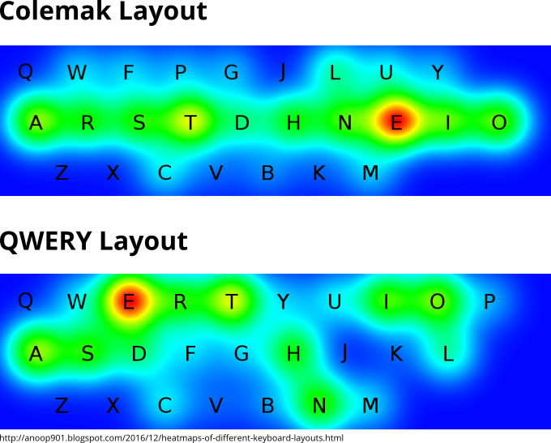

## Lock-In Effekt

_Zack. Drin._

Lock-In Effekte sind der feuchte Traum eines jeden Produktentwicklers. Sie sind der Grund, warum das zweite Apple-Gerät, das erste von vielen weiteren ist, Microsoft erstaunlicherweise immer noch existiert und ich mir wahrscheinlich nie eine Sony Kamera kaufen werde. Sie entstehen immer dann, wenn die monetären oder emotionalen Kosten ein Produkt oder einen Anbieter zu wechseln höher sind als der gefühlte Nutzen.

Es gibt Fälle, in denen diese Lock-In Effekte ohne Intention und ganz natürlich entstehen. In solchen Fällen haben es dann vor allem neue Standards schwer. Dass in der Schule der Fernseher immer noch mit VHS läuft, liegt nicht an der Überlegenheit alter Kassetten. Wahrscheinlicher ist, dass als die Schule den Fernseher angeschafft hat, die DVD noch gar nicht erfunden war. Da sich der Schulstoff seitdem nur marginal verändert hat, ist es nur sinnvoll, auch die alten Filme weiterzuverwenden. Auch dass wir heute noch das QWERTZ-Tastaturlayout nutzen, habe wir diesem Effekte zu verdanken. QWERTZ wurde nämlich eigentlich so designet, dass sich die Anschläge einer Schreibmaschine nicht in die Quere kommen. Obwohl die Schreibmaschine jetzt auch schon einige Jahre Geschichte ist, ein ergonomischeres Layout hat sich nicht durchgesetzt. Gegen diese natürlich auftretenden Effekte kann man nicht sonderlich viel machen. Glücklicherweise schafft es aber jeder wirkliche Fortschritt die natürliche Lock-In-Hürde zu nehmen.

Mit dem Aufkommen von _Digitalization_, _Servitization_ und anderen -ations treten nun immer öfter auch Lock-In Effekte auf, die mit Absicht als solche designet wurden. Sie eignen sich wunderbar als Kundenbindemittel und ermöglichen ganz neue Geschäftsmodelle. Für uns ist es dabei höchstens ärgerlich, dass manche Drucker nur mit hauseigenen Patronen laufen oder dass meine schönen Objektive nur auf Fuji-Kameras passen. In gewisser Weise ist das aber ein selbst gewähltes Schicksal. Keins dieser Produkte hat auch nur im Ansatz eine marktbeherrschende Stellung oder ist alternativlos. Problematisch wird es dann, wenn Hersteller oder Produkte eben doch marktbeherrschend sind.

Design-Entscheidungen, die dazu gedacht waren, Kunden zu binden, bremsen mit einem Mal die Weiterentwicklung ganzer Branchen. So verweigert Apple immer öfter die Implementierung von neuen Standards in ihrem Browser _Safari_. Apple möchte eben lieber, dass Apps für iPad und Co entwickelt werden, als dass sie für alle im Internet zur Verfügung stehen. Genauso sieht es mit vielen Dateiformaten aus. Wer schon mal versucht hat, eine Excel Datei mit OpenOffice zu öffnen, muss feststellen, dass man nicht wirklich von Interoperabilität sprechen kann. Ein Hörbuch, welches ich bei Amazon gekauft habe, kann ich nur über Audible hören und der einzige Weg, Android-Apps herunterzuladen, ist Google meine Daten zu geben. Weil MS-Office, Audible und der PlayStore durch ihre Größe implizit zu Standards werden, haben ihre künstlichen Lock-In Effekte auch eine Auswirkung auf den Rest der Produktlandschaft. OpenOffice ist unbenutzbar, weil alle anderen MS Office nutzen. F-Droid (eine Open-Source Variante zum Playstore) wird oft erst Wochen später oder gar nicht mit Updates versorgt, weil alle den PlayStore nutzen. Und Webstandards setzten sich nur langsam durch, weil ebenso viele Safari nutzen.

Wichtig ist hier vor allem eines: Lock-In Effekte verhindern nicht nur, dass wir anfangen andere Produkte zu nutzen. Auf lange Sicht erschweren sie es Innovation, den Weg in den Markt zu finden. Im Moment sind digitale Servicedesigner noch ganz benebelt von all den neuen Möglichkeiten, die die disruptiven Technologien der Technikunternehmen erzeugen, um Kunden zu binden. Wir müssen nur aufpassen, dass sich die Weiterentwicklung von immer besseren und geschickteren Lock-In Mechanismen nicht schneller entwickelt als echte Verbesserungen. Ansonsten wandeln sich die Vorreiter von heute zu den Bremsen von Morgen.

## Ist ein Blick wert!

_Wirklich. Mehr gibt es dazu nicht zu sagen._

<iframe width="560" height="315" src="https://www.youtube.com/embed/IvUU8joBb1Q" frameborder="0" allow="accelerometer; autoplay; clipboard-write; encrypted-media; gyroscope; picture-in-picture" allowfullscreen></iframe>

## Der gekränkte Mensch

_Noch weiß er nicht, damit umzugehen._

Der gute Sigmund Freud hat seinerzeit drei [fundamentale Kränkungen](https://archive.org/stream/eineschwierigkei29097gut/pg29097.txt) aufgestellt, die nicht an Bedeutung verloren haben. Gemeint sind nicht etwa die großen drei Beleidigungen, die wären: "Du bist dumm", "Du bist hässlich" und "_Selber_", sondern Erkenntnisse, die den Menschen in seinem Selbstverständnis gekränkt haben.

1. **Der Mensch ist nicht Mittelpunkt.** Bis Kopernikus feststellte, dass die Sonne sich nicht um die Erde dreht, waren sich alle ganz sicher, dass die Erde der Mittelpunkt von allem sein müsse. Natürlich nur, weil auf der Erde der Mensch lebt und in Wirklichkeit er der Mittelpunkt aller Dinge ist. Das muss für viele ein Schock gewesen sein. Im Laufe der Zeit stellte sich ja nicht nur heraus, dass die Menschheit der Mittelpunkt von gar nichts war, sie konnte nicht mal Platz zwei oder drei belegen. Das weite Universum schert sich nicht um den Menschen, eigentlich schert es sich um gar nichts. Richtig internalisiert haben die meisten aber heute immer noch nicht, dass sich die Welt nicht um sie dreht.
2. **Der Mensch ist auch nur ein Tier.** Dem Menschen wurde lange eine Sonderstellung unter den Lebewesen zugeschrieben (übrigens von ihm selbst). Die überlegene Krone der Schöpfung, die qua ihrer Natur über alle anderen Wesen und Dinge herrschen darf, es sogar soll. Als Darwin kam und feststellte, dass so richtig geschöpft gar nichts wurde und sich alles irgendwie mehr oder minder im Zufall entwickelte, waren bestimmt einige vor den Kopf gestoßen. Dass der Mensch nur ein Tier ist, finde ich nicht erstaunlich. Wo er sich doch so offensichtlich wie eines verhält. Ohne Sonderstellung trotzdem Sonderrechte zur Bestimmung von allem zu rechtfertigen, damit hat der Mensch weiterhin zu kämpfen.
3. **Der Mensch kann sich selbst nicht vertrauen.** Nachdem man dem armen Tier Mensch all seine Sonderrechte und Wichtigkeit abgesprochen hatte, war nun auch noch der letzte Rückzugsort dran: die eigenen Gedanken. Freud zeigt uns, dass das Ich des Menschen keinesfalls in der Kommandozentrale des Körpers sitzt und eisern unsere Befehle ausführt. Vielmehr ist Denken ein Kampf, der zwischen Bewusstsein und Unterbewusstsein ausgefochten werden muss. Auch Daniel Kahnemann führt unseren ach so verlässlichen Geist vor, als wäre er ein Schulkind, dass seine Hausaufgaben nicht gemacht hat. Gnadenlos peitscht er uns Kapitel für Kapitel die Unzulänglichkeit unseres eigenen Verstandes um die Ohren. Immer mit der Message: "Dein Gehirn wird dich austricksen, wenn du es lässt." Fakenews und Populismus zeigen, dass Teile der Menschheit wohl noch in der Phase des Nicht-Wahrhaben-Wollens in der Kränkungsbewältigung sind.

Ich finde diese Kränkungen super, weil man sie so gut verstehen kann. Obwohl man natürlich längst weiß, dass die Erde um die Sonne kreist, hält man sich doch sehr schnell für den Protagonisten des Lebens. Mit den anderen beiden ist es genauso, es ist wohl einfach sehr intuitiv, davon auszugehen, der Mensch sein sehr wichtig, sehr besonders und sehr schlau. Außerdem finde ich das Bild der Menschheit als ein trotziges, gekränktes Kind wunderbar erdend. Das nimmt der großen Menschheit etwas von ihrer Erhabenheit.

## Satzfetzen

_Irgendwann findet man sie auf der ersten Seite eines gewichtigen Buches. Bis dahin findet man sie hier._

> Prognosen sind schwierig. Vor allem, wenn sie die Zukunft betreffen!
> — Viel zitiert und immer ist es wer _Anders_

## Ein GIF für alle Fälle

_Wer kennt es nicht: Ganz plötzlich braucht man ein GIF, hat aber gerade keins zur Stelle._

<iframe src="https://giphy.com/embed/13sozYO4hmSMUw" width="100%" height="100%" style="position:absolute" frameBorder="0" class="giphy-embed" allowFullScreen></iframe>

---

_[Abbestellen](https://www.youtube.com/watch?v=dQw4w9WgXcQ)_ | _[Problem melden](https://www.youtube.com/watch?v=UG4Eg5KoGik)_
