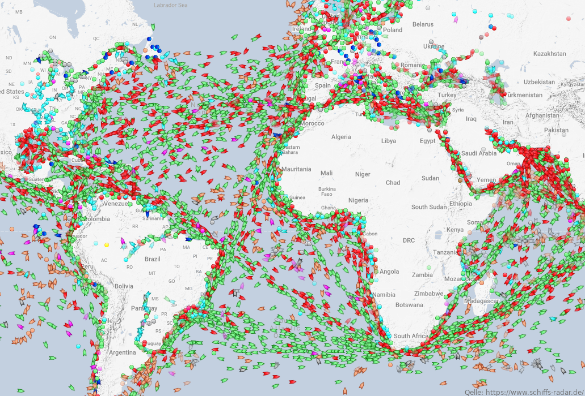

## Die größte Schwäche

In jedem Bewerbungsgespräch lauert eine Frage: "Was ist Ihre größte Schwäche?" Dabei ist diese Frage nicht nur sehr unangenehm für den Befragten, nein, es scheint mir auch, eine vollkommen sinnfreie Frage zu sein. Klar, es ist schon wichtig, dass man sich selbst einschätzen kann und damit auch weiß, wann man schwächelt. Trotzdem wird vom Interviewten wohl kaum Ehrlichkeit erwartet. Schwächen wie "Ich bin ein leicht reizbarer Choleriker", "Ich bin einfach stinkefaul" oder "Leider habe ich von keiner der ausgeschriebenen Aufgaben auch nur im Ansatz eine Ahnung" werden mit großer Wahrscheinlichkeit unerwähnt bleiben. Was also soll diese Frage? Und wichtiger, was ist die richtige Antwort? Da es sich nicht um eine ernst gemeinte Frage handeln kann, muss diese Frage einen anderen Sinn haben.

Vielleicht ist sie ein Statement über das Verhältnis zwischen Interviewer und Interviewtem? Die Frage macht deutlich, mit welcher Leichtigkeit der Interviewer das Gespräch in eine unendlich unangenehme Richtung für den Interviewten lenken könnte. Sie zeigt die Machtverhältnisse, die nur in einer solchen, flüchtigen Situation entstehen können. Der Eine ist dem Anderen völlig egal aber die Meinung des Anderen ist für den Einen von allergrößter Bedeutung. Der Interviewer muss nach einer Antwort nicht die Gegenfrage fürchten, er kann sich vollkommen außerhalb jeder sozialen Konvention aufhalten. Ist es das, was der Interviewer hier signalisieren möchte? Sagt er: "Ich bin mir der unnatürlichen Situation bewusst, wir schaffen das zusammen" oder ist es eine Drohung?

Vielleicht geht es auch nur um die Reaktion auf diese Frage. Wie cool kann man unter Stress bleiben? Dann wäre der Inhalt der Antwort völlig egal, solange man ihn selbstsicher vorträgt! A: "Was ist Ihre größte Schwäche?" B _mit geschwollener Brust_ "Das Mitochondrium ist das Kraftwerk der Zelle."

Vielleicht ist diese Frage aber auch nur ein unbrauchbares Überbleibsel aus rauer Vorzeit, in der die Menschen es noch nicht besser wussten als ehrlich zu sein. Ganz wie der Blinddarm sich hartnäckig gehalten hat, ist auch diese Frage einfach nie aus dem Fragenkatalog verschwunden. Da sie allerdings keinen Einfluss mehr auf irgendeine Entscheidung hat, kann man sie getrost mit einem "Nächste Frage, bitte!" überspringen.

Was ist sie also, die perfekte Antwort? Jasper, was ist deine größte Schwäche? "Wahrscheinlich, dass selbst kleinste und einfachste Fragen endlose Auslassungen über Grundsätzliches zur Folge haben."

## Ist ein Blick wert!

_Wirklich. Mehr gibt es dazu nicht zu sagen._

<iframe width="560" height="315" src="https://www.youtube.com/embed/lNeGkjaGtY8" title="YouTube video player" frameborder="0" allow="accelerometer; autoplay; clipboard-write; encrypted-media; gyroscope; picture-in-picture" allowfullscreen></iframe>

## Container über Container

_über Container über Container_

Bis vor einigen Tagen steckte im Suez-Kanal eines der größten Containerschiffe der Welt fest. Ein Schiff von solch gewaltigen Ausmaßen, dass es sich wie ein Gebirge über dem Kanal auftürmte. Die _Evergiven_ ist ein schöner Indikator für die unfassbaren Ausmaße des weltweiten Containerschiffshandels. Mehr Handel bedeutet für die Weltmeere nicht nur mehr Schiffe, sondern vor allem größere Schiffe, sehr viel größere Schiffe. War 2003 die OOCL Shenzen mit einem Fassungsvermögen von 8000 Containern schon ein verdammt großes Schiff, so ist die HMM Megamax-24 von 2020 mit ihren 23.964 Container so groß, dass man sich fragt, wie ein solches Ungetüm überhaupt schwimmen kann. 400 Meter lang und 61 Meter breit wird sie nur von einigen wenigen Matrosen bemannt. Die knapp 24 Tausend Container sind allerdings ein Witz gegenüber den 24 Millionen Containern, die auf allen Containerschiffen der Welt zusammen Platz fänden.

Schifffahrt ist schon irgendwie fantastisch. Die bloßen Volumen, die die Menschen auf ein Schlag bewegen können, sind unvorstellbar groß. Man stelle sich einmal einen Zug mit 24 Tausend Wägen vor. Oder man danke an den tagelangen Stau, der das Umladen auf LKWs zur Folge hätte. Man sieht schon, für den Moment findet sich keine Alternative zu den Containerschiffen.

Dazu sind Containerschiffe noch recht CO2-Emissionseffizienz. Wo ein LKW 50 Gramm CO2 auf die Tonne und den Kilometer ausstößt, sind es bei den Containerschiffen nur 15 Gramm. Das ist nicht nichts, aber sehr viel weniger. Eigentlich prima, wäre da nicht an winziges Problem. Das Problem hört auf den Namen Schweröl. Das hört sich schon schlecht an und ist auch richtig giftig. Nach Möglichkeit sollte man es nicht verbrennen und noch besser es einfach im Boden lassen. Verbrennt man es doch, bekommt man es mit Schwefeloxiden, Feinstaub, Stickoxiden und einer Menge Ruß zu tun. Verbrennt man es nicht, muss es als Sondermüll entsorgt werden. Was das bedeutet weiß niemand. Im Zweifel wird es dann doch verbrannt oder ins Meer gekippt.

Besonders spannend wird es allerdings, wenn ein mit Schweröl betankter Kahn ein Leck schlägt. Dann laufen mal gut und gerne 2.000 Tonnen Öl ins Meer. Einige Wochen sieht man Vögel mit verklebtem Gefieder in den Nachrichten, dann ist alles wieder vergessen. Entsorgung von Schweröl ist schon schwer genug, wenn man es an einem Fleck hat, wenn es sich über große Meeresgebiete verteilt, dann gute Nacht.

Fest steht eins: Der globale Handel braucht Containerschiffe. Man kann sich darüber streiten, ob wir den ganzen Kram in den Containern brauchen, aber das ist eine andere Diskussion. Aber für die Mengen an Im- und Exporten, kommen wir um große Schiffe nicht herum. Wenn wir diese Mengen also weiter ermöglichen wollen, müssen wir uns wirklich noch mal ran setzten. Für das Klima bleibt ein verstopfter Suez-Kanal ansonsten das vernünftigste Mittel.

## Satzfetzen

_Irgendwann findet man sie auf der ersten Seite eines gewichtigen Buches. Bis dahin findet man sie hier._

> Zwei Juristen: drei Meinungen.
> — Unbekannt

## Ein GIF für alle Fälle

_Wer kennt es nicht: Ganz plötzlich braucht man ein GIF, hat aber gerade keins zur Stelle._

<iframe src="https://giphy.com/embed/xTiTnf0p8Vt1vKyVTq" width="480" height="480" frameBorder="0" class="giphy-embed" allowFullScreen></iframe>

---

_[Abbestellen](https://www.youtube.com/watch?v=dQw4w9WgXcQ)_ | _[Problem melden](https://www.youtube.com/watch?v=UG4Eg5KoGik)_
