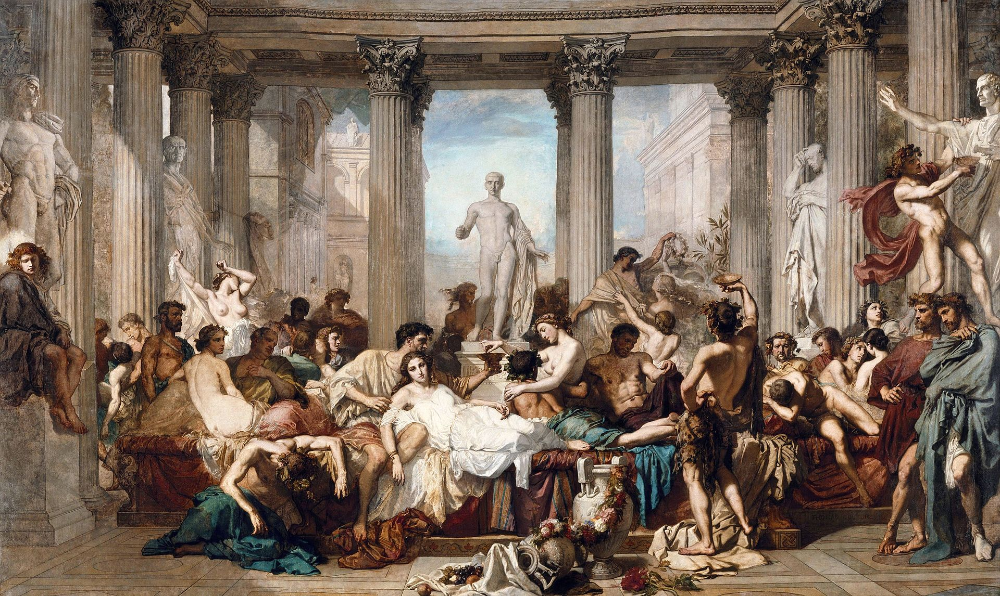
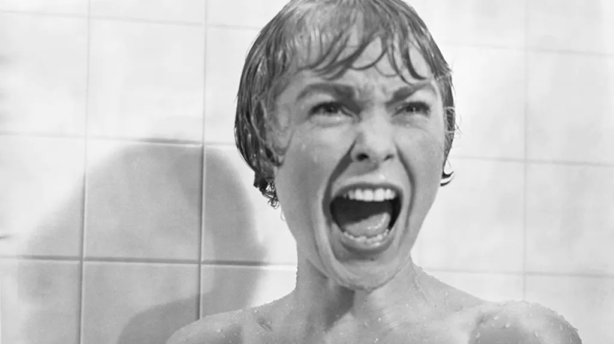

## Kopfschütteln

_Wenn die Worte fehlen._

Mit Verspätung, für die sich kein vernünftiger Grund finden lässt, beginnt jetzt am KIT das neue, digitale Semester. Unter normalen Umständen würden in dieser Woche in den Parks und vor den Uni-Gebäuden frische Studenten herumlungern. Im Treiben neuer Gesichter würden sie versuchen, Kontakte zu knüpfen und ein Gemeinschaftsgefühl zu schaffen. Im Zentrum dieses Ereignisses stünde, nicht unerwartet, der Alkohol. Weniger als Genussmittel, das sich natürlich in das Geschehen eingliedert, sondern mehr als rahmengebende Instanz. Ganz nach dem Motto: _Wir trinken nicht, weil wir Spaß haben, sondern wir haben Spaß, weil wir trinken._ Das ist dieses Jahr natürlich ganz anders.



Ein Kennenlernen wird es wohl nur digital geben müssen. Über eine Webcam ist das, was den Alkohol so berauschend macht, nur schwer zu vermittel. Spätestens, wenn um halb neun jegliche Feierwut verflogen ist, man dann ganz alleine und sturzbesoffen in seinem kleinen Zimmer sitzt, merkt man, wie wenig so ein Konzept funktionieren kann. Also muss ein neues Konzept her! Prima, Corona hilft uns eben auch in andere Richtungen zu denken. Das ist mir übrigens nur recht. Ich habe mich sowieso schon oft gefragt, wie sich "Saufen" zur Hauptbeschäftigung einer solchen Veranstaltung aufschwingen konnte. Da setzen sich die Wirtschaftswissenschaftler, die ständige etwas von Disruption, _Unique Selling Proposition_ und Innovation faseln, lange zusammen und jedes Jahr aufs Neue kommen sie aus ihrem _Meeting_ und stellen uns das neue Thema vor: "_Saufen_". Nun ja, dieses Jahr geht das also nicht, hier Auszüge aus dem neuen Vorschlag:

```
Wichtige Hinweise:
Wir treffen uns um 13 Uhr in Jitsi.

- Schmeißt euer Gemüse aus dem
  Kühlschrank und macht Platz für Bier,
  Schnaps, Wein und weitere alkoholische Genüsslichkeiten
- Motivationslücken oder billige Ausreden
  könnt ihr euch fürs Studium aufheben [...]
- Nehmt eure Leber aus dem Schrank und setzt sie in
  eure Astralkörper ein. Sie steht vor einem großen
  Arbeitseinsatz. Für Folgeschäden wird keinerlei Haftung
  übernommen.
  [...]
  Ansonsten wünschen wir euch schon mal einen
  schönen Tag und einen gezielten Abschuss 🍺🍷
```

Warte mal, was?! Man könnte jetzt den Organisatoren Genius zuschreiben. Entgegen aller Erwartung so etwas vorzuschlagen. Ja, k*önnte* man; wirklich können, kann man aber nur eines, Kopfschütteln.

## Ist ein Blick wert!

_Wirklich. Heute muss allerdings etwas dazu gesagt werden._



**Psycho** ist schwarzweiß im 4:3 Format aufgenommen und von 1960. Die, die sich für besonders cool halten, weil "alte-Filme-gucken" ein Teil ihrer Identität ist (ja, ich meine mich), muss ich nicht überzeugen. Für alle anderen ist es eine echte Empfehlung. In den erste paar Minuten denkt man sich: "Jaja, immer diese lahmen schwarzweiß Filme." Nur um dann 109 Minuten später schweißgebadet auszuatmen. Psycho baut kunstvoll Spannung auf und kommt ohne Jump-Scares und Gewaltexzesse aus. Es ist vielleicht also ein Horrorfilm für die, die sich vor modernem Horror zu sehr fürchten.

## Zu Tisch

_sitzt man momentan oft allein und liest. Dabei stolpert man über neue Ideen._

Georg Wilhelm Friedrich Hegel ist wirklich ein beeindruckender Name. Weltgeist nennt man ihn und wie ein Geist spukt er durch die Gegend, ohne, dass man wirklich weiß, was dieser Hegel eigentlich zu sagen hatte. Vor allem ein Begriff scheint Hegel auf dem Fuße zu folgen: die Dialektik. Ein bedeutungsschweres Wort, das jeden Gesprächspartner, der es nicht kennt, mühelos in die Flucht schlagen kann. Dem entgegenzuwirken, will ich einmal versuchen zu umreißen, was mit Dialektik gemeint ist. An dieser Stelle eine Warnung: Ich bin nicht Hegel. Erschreckend, ich weiß. Was ich aber sagen will ist, was jetzt kommt, ist stark beeinflusst von meinem _persönlichen_ Verständnis. Nun aber zur Sache.

Dialektik, oder viel mehr der dialektische Prozess ist keine Erfindung Hegels. Auch Platon — schon wieder so ein großer Name — beschrieb einen solchen Prozess und wie ich finde, lässt sich hier der Grundgedanke gut greifen. Platon kleidet fast alle seine philosophischen Gedanken in einen Dialog. In seinen Schriften stehen sich zwei Redner gegenüber. Der eine formuliert eine These, sofort hakt der andere nach und zerlegt die These, nur um dann eine Antithese zu präsentieren. Schnell kann man glauben, dass "dialektischer Prozess" ein geschwollener Begriff für "Pro-Contra Abwägung" ist. Die Dialektik legt allerdings einen besonderen Fokus auf das Bewahren von Teilen eines Gedankens. In der Antithese spiegelt sich also auch wider, was eigentlich Gutes und Erhaltenswertes in der These steckt. Jede Antithese wird dann wieder eine neue These und das Spiel geht von vorne los. Dieser Prozess mündet dann in der Synthese, also dem Besten aus beiden Welten.

Hegel nimmt nun dieses Grundkonzept und denkt es weiter. Das besondere für Hegel ist, dass in jeder These auch gleichzeitig ihre eigene Antithese steckt. Ein Beispiel: Der Mensch ist frei. Jeder kann also machen, wonach ihm gerade ist. Weiter gedacht, müssen wir aber erkennen, wenn alle uneingeschränkt frei sind, sind sie es in Wirklichkeit nicht. Ich lebe meine Freiheit aus, indem ich mit 180 km/h durch die Innenstadt fahre. Mit Sicherheit schränke ich damit Andere in ihrer Freiheit ein, einen gemütlichen Sonntagsspaziergang zu machen. Ganz plötzlich bin nur noch ich frei, alle anderen aber nicht. Die These zu Ende gedacht, ist also ihre eigene Antithese. Nachdem dies erkannt ist, folgt der nächste dialektische Schritt, das _Aufheben._ Hegel ist hier ein kluges Sprachspiel gelungen, indem er _aufheben_ in drei Bedeutungen interpretiert. Ich hebe alle Bewahrenswerten Gedanken auf; aufheben also im Sinn von bewahren. Dann hebe ich als falsch erkannte Gedanken auf; aufheben im Sinne von nichtig machen. Zu guter Letzt erhebe ich die Gedanken aus These und Antithese in einen neuen Zustand, die Synthese; aufheben also im Sinne von auf eine höhere _Stufe_ stellen. Im Unterschied zu Platons Dialektik ist bei Hegel der dialektische Prozess innerlich und fließend. Sobald man versucht ihn zu formalisieren, ist man zum Scheitern verurteilt. Das liegt daran, dass man den Gedanken durch das Formalisieren in einem Zeitpunkt festnagelt, wir können so also nur noch Erkenntnis über Vergangenes machen.

Es gibt mit Sicherheit sehr viel mehr über die Dialektik zu sagen und zu verstehen. Ich will aber weder den Rahmen meines Verständnisses, noch den dieses kurzen Textes sprengen. Im Kern nehme ich vor allem zwei Dinge mit: Erstens ist es ungemein wichtig, sich in der kritischen Auseinandersetzung mit Positionen immer wieder zu fragen, welche Aspekte an dieser Position bewahrenswert sind. Zweitens ist es wichtig, Positionen zu Ende zu denken, um ihre Implikationen zu verstehen. Wir können dadurch auch Gegenpositionen besser nachvollziehen. Für Hegel können wir nur durch dialektisches Denken neue Erkenntnis erlangen und vielleicht verbessern wir ganz nebenbei auch noch die Debattenkultur.

## Satzfetzen

_Irgendwann findet man sie auf der ersten Seite eines gewichtigen Buches. Bis dahin findet man sie hier._

> _Handwerkszeug des Abdeckers war der bloße Meichel, mit dem er beim Fetzen dem Kuffert den Sturz ablöste und den Schmuck abfäberte. Die für gewöhnlich befoschte Plautze kam in den Fetzsack und wurde in der Schinderschupfe gesäubert. Das Bossert wurde vergraben._
>
> — ein Lexikoneintrag über den Beruf des Abdeckers, manche Berufe kommen eben aus der Mode

## Handlungsempfehlung

_In einer Pandemie muss man über alle Handlungen doppelt nachdenken, schon kleine Änderungen im Verhalten können eine große Auswirkung haben._

Es gibt immer noch Menschen, die offensichtlich den Ernst der Lage nicht verstanden haben. Obwohl die allermeisten denkenden Menschen Maßnahmen annehmen und umsetzen, so gibt es doch an entscheidenden Punkten Unzulänglichkeiten. Das fängt vor allem bei der Sprache an. Wir wissen alle, wie elementar eine richtige Sprache sein kann. Ich empfehle hiermit also den coronakonformen Witz. Das kann dann in etwas so aussehen:

Zwei Spechte sitzen im Winter mit einem Mindestabstand von 1,5 Meter auf einem Ast. Sagt der eine Specht, der hat — nebenbei bemerkt — eine Maske auf, "Mensch, ist mir kalt". Darauf antwortet der andere Specht, dieser hat ebenfalls eine Maske auf, erstaunt, "Ach krass, ein sprechender Specht". Beide Spechte hatten zuvor wahrheitsgemäße Kontaktangaben gemacht.

## Ein GIF für alle Fälle

_Wer kennt es nicht: Ganz plötzlich braucht man ein GIF, hat aber gerade keins zur Stelle._

<div style="width:100%;height:0;padding-bottom:56%;position:relative;"><iframe src="https://giphy.com/embed/Q8fN8ADCh5UWI" width="100%" height="100%" style="position:absolute" frameBorder="0" class="giphy-embed" allowFullScreen></iframe></div>

<hr/>
